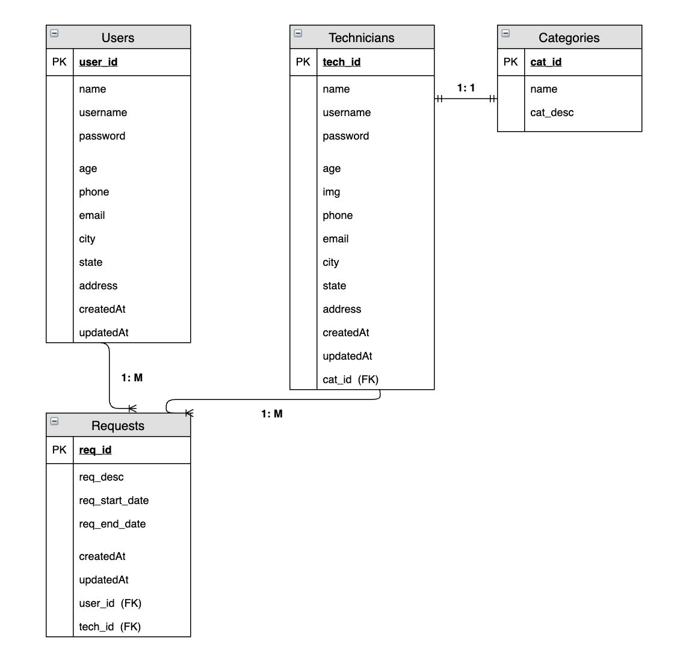

<!--  -->

# Project 4 - Handyman On Demand

Disgned and Developed by:

- Sachin Ramteke

## Project Overview:-

## Project Description

"Handyman on Demand" App is for creating work requests, searching the work technicians (a.k.a handyman), and variety of work request.
This app helps you to complete your work demand (whether you need a plumber, carpenter, electrician, mechanic etc.)

### Learning Goal: Develop a full stack application using REACT framework and Postgres Database, with the following features:-

- Use a third party API; Usage of axios
- Usage of React Components
- State management
- GIT code integration - code check-in, check-out

- Heroku production deployment
- Implementation of REST-ful routes

## Minimum Viable Product (MVP):-

- MVP goal: The React application (i.e. Handyman On Demand) has been designed and developed to submit a work requst and to search a technician (a.k.a. Handyman) (whether it is plumbing requests, grocery deliveries, or finding nanny etc.):

- A working REACT application, using Node.js, Express, React Dom, React Dom Router

<!-- * Connect to third party Quotes API -->

- Render the details of work requests and handymans (a.k.a. Technicians) on the webpage
- Allow users to interact with the page and perform work and technicians searches

## Project Links

GitHub Repository:

- Backend Express API :- https://github.com/sramteke171/handyman_backend
- Frontend React API :- https://github.com/sramteke171/handyman_frontend

deployment :-

<!-- https://seigot-quotes.herokuapp.com/ -->

<!-- 3rd Party API Link: https://gameofthronesquotes.xyz/ -->

## Wireframes

App homepage Wireframe: (included under documents folder)

## Technologies

- Visual Studio Code – Main Development Tool
- REACT Framework
- CSS
- JavaScript
- Node.JS
- JSON
- Express
- Browser compliant: Chrome, IE, Firefox

## File Structure:

Handyman On Demand (React App)

- REDME.md
- node_modules
- package.json
- package-lock.json
- public
  - Images
- src

  - App.js
  - Components
    - Header.js
    - Home.js
    - AllCustomers.js
    - CustomerDetail.js
    - AllTechnicians.js
    - TechnicianDetail.js
    - AllRequests.js
    - RequestDetail.js
    - Signup.js
    - Login.js

  <!-- - Images.json -->

## Additional Libraries

- Dependencies on following packages:

  - "@testing-library/jest-dom": "^4.2.4",
  - "@testing-library/react": "^9.3.2",
  - "@testing-library/user-event": "^7.1.2",
  - "axios": "^0.20.0",
  - "react": "^16.13.1",
  - "react-dom": "^16.13.1",
  - "react-router": "^5.2.0",
  - "react-router-dom": "^5.2.0",
  - "react-scripts": "3.4.3"

## Framework used

- REACT Framework

- App.js :- contains code for routes to the components, API calls, and rendering elements of App. For example, it is used for connecting Front-end app with Back-end express API. It contains various REST-ful routes for Create, Retrieving (Read), Update, and Delete the information of customers, work requests, and technicians.

REACT Components:

- Header.js - is used for rendering a header and navigation bar
- Home.js - for displaying landing page
- AllCustomers.js - is used for showing the list of all customers
- CustomerDetail.js - is used for showing the details of each customer and editing the customer information.
- AllTechnicians.js - is used for showing the list of all technicians
- TechnicianDetail.js - is used for showing the details of each technician and editing the handyman information.
- AllRequests.js - is used for showing all work requests with requested start-date and end-dates
- RequestDetail.js - is used for editing the work request
- Signup.js - is used for signing up the users/customers
- Login.js - is used for authentication and user login

## App Components

- App:- This will make the initial data pull and include functionality, React Router
- Header:- This will render the header including the navigation bar
- Footer:- This will render the footer

## MVP User Stories:

1.  UserStory 01: App Landing page

    - As a user, I would like to see the Handyman On Demand homepage with header and navigation bar

2.  UserStory 02: Clickable links from Navigation bar

    - As an Admin user, I would like to see clickable links to view all work request, all customers, and all technicians.

3.  UserStory 03: View all Work-Requests

    - As an Admin user, I would like to see all the work requests after clicking on "Work Request" link on navigation bar

4.  UserStory 04: View all Customers

    - As an Admin user, I would like to see the list of customers after clicking on "Customers" link on navigation bar

5.  UserStory 05: View all Technicians

    - As an Admin user, I would like to see the list of technicians/handymen after clicking on "Technicians" link on navigation bar

6.  UserStory 06: New Customer/User Creation

    - As an Admin user, I would like the ability to create a new customer when I'm viewing the list of all customers.
    - New customer's infomration should be inserted into postgres DB after clicking "Add Customer" button

7.  UserStory 07: EDIT CustomerProfile

    - As an Admin user, I would like the ability to edit any of the customer profiles after (a) clicking on the name of a customer (b) and changing the profile information
    - After clicking a "EDIT" button, edited information should be inserted into postgres DB

8.  UserStory 08: DELETE CustomerProfile

    - As an admin user, I would like the ability to DELETE a particular customer.
    - After clicking a "DELETE" button of a specific customer, chosen customer record should be deleted from postgres DB

9.  UserStory 09: New Technician/Handyman profile Creation

    - As an Admin user, I would like the ability to create a new handyman/technician when I'm viewing the list of all technicians/ handymen.
    - New technician/handyman's infomration should be inserted into postgres DB after clicking "Add Technician" button

10. UserStory 10: EDIT TechnicianProfile

    - As an Admin user, I would like the ability to edit any of the technician profiles after (a) clicking on the name of a technician (b) and changing the profile information
    - After clicking a "EDIT" button, edited information should be inserted into postgres DB

11. UserStory 11: DELETE TechnicianProfile

    - As an admin user, I would like the ability to DELETE a particular technician/handyman.
    - After clicking a "DELETE" button of a specific technician, chosen technician record should be deleted from postgres DB

12. UserStory 12: New Work-Request Creation

    - As an Admin user, I would like the ability to create a new work-request when I'm viewing all the work-requests.
    - New work request with the details of work, requested_start_date and requested_end_dates should be inserted into postgres DB after clicking "Add Request" button

13. UserStory 13: EDIT Work-Request

    - As an Admin user, I would like the ability to edit any of the work-requests on behalf of customers after (a) clicking on the specific work-request from the list (b) and changing the work request details
    - After clicking a "EDIT" button, edited work-request should be inserted into postgres DB

14. UserStory 14: DELETE Work-Request

    - As an admin user, I would like the ability to DELETE a particular technician/handyman.
    - After clicking a "DELETE" button of a specific technician, chosen technician record should be deleted from postgres DB

15. UserStory 15: Web-Responsive

    - When user minimizes the browser-window, app should scale accroding the size of browser-window

## Stretch Goal / Above & Beyond:

- PostMVP, there would be addional functionalities - to search technician by work categories, cities, image profile, security(authentication) etc.
- Handyman should be able to chatt or call customer's phone using an App

## Issues and Resolutions

ERROR: "TypeError: Cannot read property 'id' of undefined"

Details:-
Faced an issue with one of the routes - postman wasn't returning "id" values from the Requests table. and front-end was throwing "TypeError: Cannot read property 'id' of undefined". From App.js, I was making an API call to get all the work-requests. (postman wasn't pulling "id" which is the primary key).

Front-end code:
render() {
const allRequests = this.props.requests.map((request) => {
console.log("allRequests- request.id", request.id);
return (

<Link to={/requestsC/${request.id}}> {request.req_desc} Delete 
);
});

- RESOLUTION: After using the "Atributes" in router.get(), fixed an issue -->

// GET ALL Requests in RequestController of Back-end App

router.get("/", async (req, res) => {
let requests = await RequestModel.findAll({
attributes: [
"id",
"req_desc",
"req_start_date",
"req_end_date",
"user_id",
"tech_id",
],
});
res.json({ requests });
});

## Next Steps: "PostMVP"

- Implement addional functionalities - to search technician by work categories, cities, image profile, security(authentication) etc.
- Handyman should be able to chatt or call customer's phone using an App
